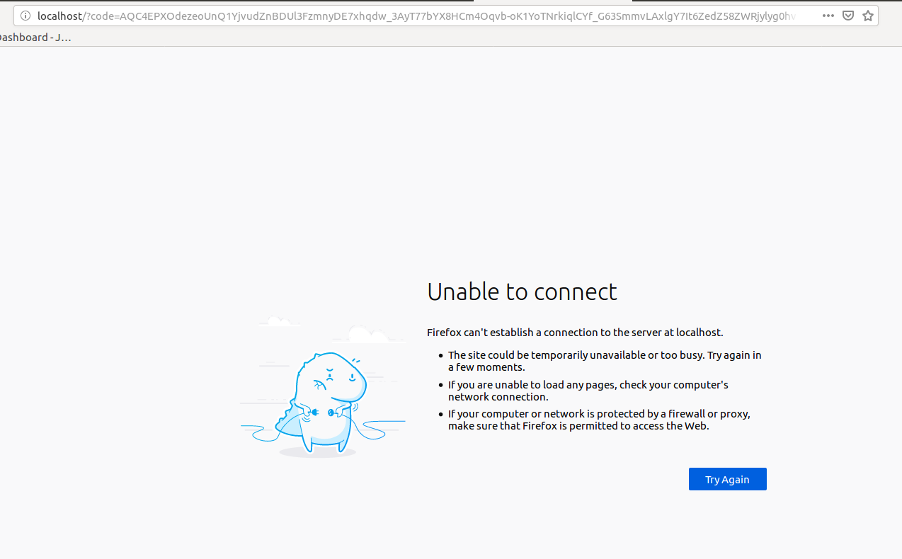
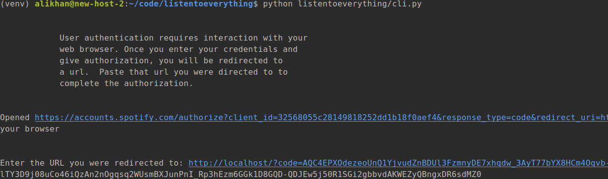

==================
listentoeverything
==================

.. image:: https://img.shields.io/pypi/v/listentoeverything.svg
        :target: https://pypi.python.org/pypi/listentoeverything
.. image:: https://img.shields.io/travis/happykhan/listentoeverything.svg
        :target: https://travis-ci.org/happykhan/listentoeverything
.. image:: https://img.shields.io/pypi/v/listentoeverything.svg
        :target: https://pypi.python.org/pypi/listentoeverything
        :alt: Pypi
.. image:: https://img.shields.io/docker/build/happykhan/listentoeverything.svg
        :target: https://cloud.docker.com/repository/docker/happykhan/listentoeverything
        :alt: Dockerhub
.. image:: https://img.shields.io/coveralls/github/happykhan/listentoeverything.svg   
        :alt: Coveralls github
.. image:: https://img.shields.io/scrutinizer/coverage/g/happykhan/listentoeverything.svg   :alt: Scrutinizer coverage
.. image:: https://pyup.io/repos/github/happykhan/listentoeverything/shield.svg
     :target: https://pyup.io/repos/github/happykhan/listentoeverything/
     :alt: Updates

Scrapes good music off Reddit, makes a spotify playlist

Installation and Usage
----------------------

.. code-block:: bash

    git clone git@github.com:happykhan/listentoeverything.git
    cd listentoeverything
    pip install -r requirements.txt

Then run:

.. code-block:: bash

    python listentoeverything/cli.py --config_file <config_file.yml>

Configuration
-------------
You will need to sign up to the Spotify API and reddit API.
* https://developer.spotify.com/documentation/web-api/
* https://www.reddit.com/dev/api/

They will issue you with various authorisation keys which you need to
specify in the config file (default location is ~/.listen).

.. code-block:: yaml

    reddit:
       client_id: <Your key>
       client_secret: <Your key>
       user_agent: listenonspotify
       username: <Your reddit username>
       password: <Your pass>
    spotify:
       username: <Your spotify username>
       scope: playlist-modify-public
       client_id: <Your key>
       client_secret: <Your key>
       redirect_uri: http://localhost/

Spotify login
-------------
Spotify requires users to authorise 3rd party programs through the website.
Normally the first time you run this script it will open a web browser and redirect you
to spotify, where a user would need to click authorise. Then it will come back to
a redirect URL. As this isn't a website, I just send it back to localhost.

The script will want to know what the URL was, including the code. So copy this
from the address bar and paste in the prompt.

The token will be cached for a while so you do not need to do this every time.

License
-------
listentoeverything is free software under the GNU General Public License v3.

Credits
-------

This package was created with Cookiecutter_ and the `audreyr/cookiecutter-pypackage`_ project template.

.. _Cookiecutter: https://github.com/audreyr/cookiecutter
.. _`audreyr/cookiecutter-pypackage`: https://github.com/audreyr/cookiecutter-pypackage
